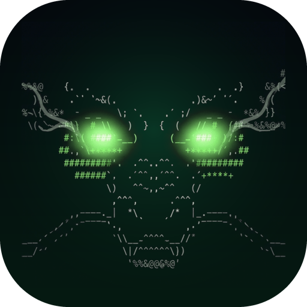
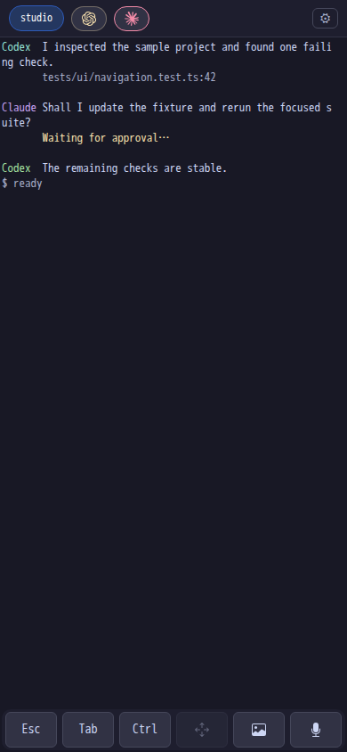
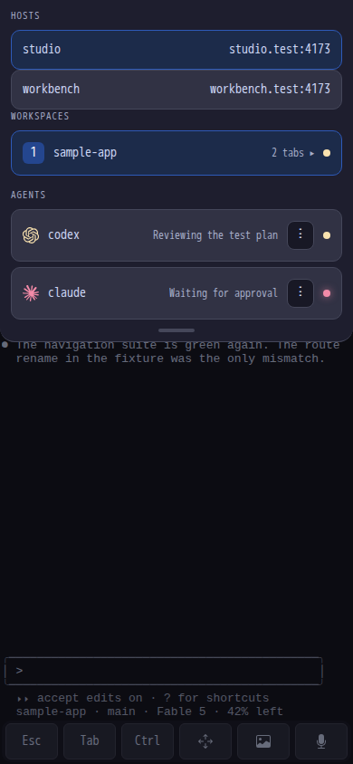
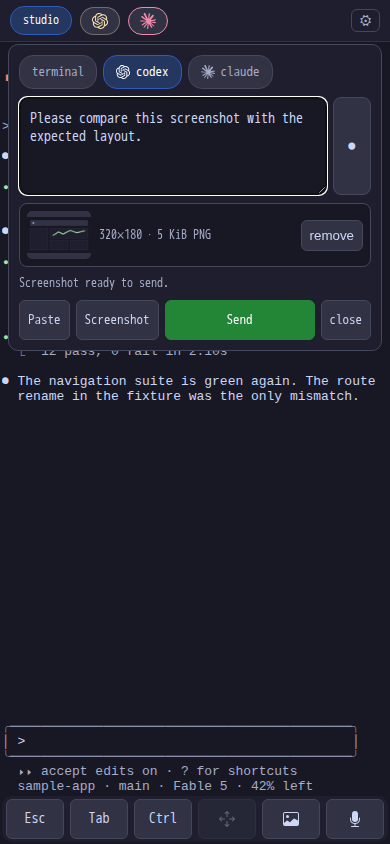
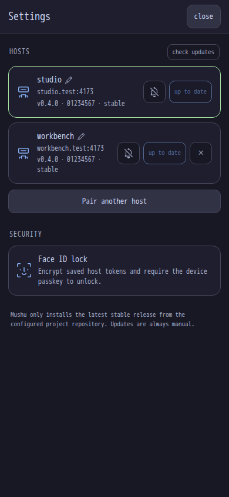
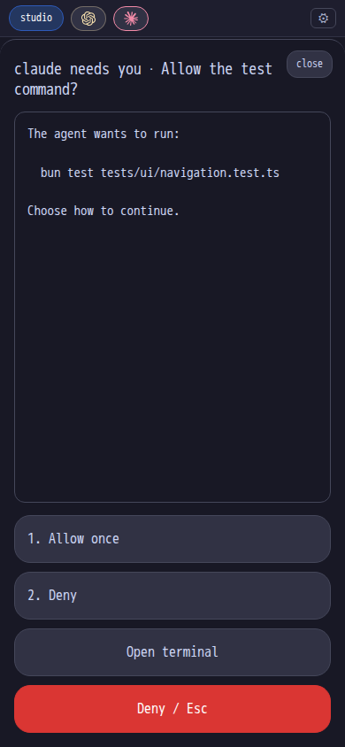

<div align="center">

<h1>Mushu</h1>
<p><b>Leave your desk, not your agents.</b></p>
</div>

> A mobile PWA for AI coding agents. It is a control surface for your harness running in [Ghostty](https://ghostty.org) and [Herdr](https://herdr.dev) on your own machines: the same live session as your desktop, with mobile-friendly controls. Fully open source and self-hosted.

## Features

- Real terminal on your phone, attached to the exact same Herdr session as your desktop (theme included).
- Installable PWA with a touch toolbar; sessions survive network switches and phone sleep.
- Agent inbox: live status chips for every agent (working, blocked, done, idle).
- Push notifications when an agent needs input or finishes, end-to-end encrypted.
- One-tap approve/deny, quick keys, or a full prompt (text/voice) with one gallery screenshot, stale-guarded and audit-logged.
- All your machines in one app: switch hosts from the drawer, alerts on or off per host.
- Sign in and pair more hosts by scanning QR codes; optionally lock your tokens behind Face ID.
- Install the latest stable Mushu release on each host from Settings, with checksum and staged-binary verification before restart.
- Private by construction: loopback bind, published tailnet-only via Tailscale Serve. No sshd, no app store, no third-party relay.

## Install

> [!NOTE]
> Prerequisites:
> - a host (macOS or Linux) running [Herdr](https://herdr.dev)
> - a [Tailscale](https://tailscale.com) tailnet joining the host and phone

On each host, install `mushu-server` and `mushuctl`:

```sh
curl -fsSL https://raw.githubusercontent.com/campingas/mushu/main/install.sh | sh
```

It installs two files in `~/.local/bin`:

1. [`mushu-server`](docs/architecture.md#mushu-server-rust-daemon-this-repo)
2. [`mushuctl`](docs/mushuctl.md)

Prefer to do it yourself?

Grab the matching asset from [releases](https://github.com/campingas/mushu/releases) and verify it against the published `SHA256SUMS`, or build from source with Rust:

```sh
git clone https://github.com/campingas/mushu && cd mushu
cargo build --release
install -m 755 target/release/mushu-server scripts/mushuctl ~/.local/bin/
```

Then, on each host:

```sh
mushuctl install-service                    # token, service unit, then start
tailscale serve --bg http://127.0.0.1:8422  # tailnet-only HTTPS
```

`mushuctl install-service` generates an access token at `~/.config/mushu-token` if there is none, renders the launchd plist or systemd user unit, installs it, and starts Mushu on `127.0.0.1:8422`. It is safe to re-run: an existing token is never replaced, because a new one would lock out every phone already paired to this host. Use `--print` to read the unit without installing it, and see [docs/mushuctl.md](docs/mushuctl.md) for replacing a unit you have customized.

Configuration is all environment variables:

| Variable | Default | Purpose |
|---|---|---|
| `MUSHU_TOKEN_FILE` | preferred | path to an access token file, trimmed after reading; takes precedence over `MUSHU_TOKEN` |
| `MUSHU_TOKEN` | required without a token file | compatible inline access token, 16+ chars |
| `MUSHU_BIND` | `127.0.0.1:8422` | listen address |
| `MUSHU_CMD` | `herdr` | command attached to the web terminal (e.g. `tmux new-session -A -s main`) |
| `MUSHU_HOST` | hostname | label shown in the inbox and notifications; a per-device rename in Settings overrides it in the app |
| `MUSHU_URL` | Tailscale Serve mapping | public URL used by `mushuctl pair`, when auto-discovery cannot find it |
| `HERDR_CONFIG_PATH` | Herdr/XDG default | inherited Herdr config path used only to adapt the active host theme; ignored for a non-Herdr `MUSHU_CMD` |

## Pair your phone

Run `mushuctl pair` on the host. It prints a QR code for the tailnet URL with the token in the URL fragment, discovering the URL from your Tailscale Serve mapping (override with `MUSHU_URL`):

1. Scan it with the iPhone camera.
2. On that page: Share, then **Add to Home Screen**.
3. Open mushu from the home screen. It is already signed in.

Add to Home Screen while the fragment is still in the URL: iOS gives an installed web app a storage jar separate from Safari's, and the token travels in the bookmark. Fragments are never sent to a server, so the token never reaches a log or proxy trace.

Then open the cog and turn on alerts to enable push notifications (iOS 16.4+, requires the home screen install).
Optionally tap **enable face id lock**: your host tokens are then encrypted at rest with AES-GCM under a passkey held in the Secure Enclave, and opening the app asks for Face ID.

## More than one host

Repeat the install above on each host, then run `mushuctl pair` on the additional host and open the settings. Tap **Pair another host** and either scan that QR with the rear camera or choose an image containing it. The app accepts only an HTTPS Mushu pairing URL with the token in its fragment, authenticates `/api/host`, and requires the host to share this app's VAPID key before saving it. Saved hosts appear under **hosts** in the drawer, and tapping one switches the terminal and inbox without leaving the app. Each host has its own alerts toggle.

Push notifications from a second host need one extra step, because a browser holds a single push subscription tied to one VAPID key. Give every host the same keypair:

```sh
mushuctl vapid-export | ssh otherhost '~/.local/bin/mushuctl vapid-import'
```

`mushuctl pair` offers to do this for you at the end of pairing: it asks which host to copy from, shows the command, and runs it only on `y`. Note the direction, it pulls the established key onto the host you just paired, because pushing the other way would clear the working host's subscriptions.

The full remote path is deliberate: a non-interactive ssh shell gets no login PATH. `vapid-import` rejects anything that is not a well-formed key, backs up the one it replaces, clears the subscriptions that were signed against the retired key, and restarts Mushu only if it was already running. Running it again once both hosts agree does nothing.

Do this before in-app pairing. A host with a different VAPID key is refused because its alerts cannot reach this installed app.

## Update a host

Settings shows the tag, commit SHA prefix, and build kind reported by every host. Tap **check updates**, then **install v…** to install the current latest stable release from `campingas/mushu`. A Face ID-enabled app re-authenticates before showing the host/current/latest confirmation; an app without the vault still requires the same explicit confirmation.

The host re-checks GitHub's latest stable release when the install request arrives. It will not accept a prerelease, version picker, downgrade, stale tag, concurrent job, alternate repository, or arbitrary download URL. The matching platform binary and `SHA256SUMS` are downloaded over bounded HTTPS, the exact checksum and staged `--version` identity are verified, and only then is the executable atomically replaced. The old executable remains beside it as `mushu-server.previous`; the daemon closes sessions cleanly, re-execs itself, and the PWA reconnects. Failed checks leave the running executable untouched.

Source and workflow builds identify themselves with `mushu-server --version`. Only binaries produced from a `v*` release tag have the `stable` build kind and may self-update; ordinary local and workflow-dispatch builds are deliberately `dev`.

Running `install.sh` again is intentionally different from the in-app updater: it only places the verified binaries. If Mushu is active, the script tells you that the old process remains running and leaves the restart to you, so an install never drops a live terminal session automatically.

## Uninstall

On each host:

```sh
mushuctl uninstall
```

It lists everything it will delete, then asks before touching anything. Without a terminal it refuses unless you pass `--yes`, so it cannot run away with a piped script.

It first proves the service is stopped and unloaded, then removes the service unit, the verified sibling `mushu-server`/`mushuctl` pair, `~/.config/mushu-token`, `~/.config/mushu` (VAPID key, subscriptions, action log), the upload cache under `~/.cache/mushu`, and the exact configured log file on macOS. A stop or unload failure leaves everything untouched. The token and VAPID key go with it, so a later reinstall means pairing every phone again.

Two things it deliberately leaves alone: your Tailscale Serve mapping, since removing it could disturb other services on that host, and Herdr. It prints `tailscale serve status` so you can review the mapping yourself.

## Screenshots

These anonymous Chromium baselines are generated from the real PWA assets by the visual regression suite; they are product views, not iOS or Web Push delivery validation.

| Terminal agent session | Two-host drawer |
|---|---|
|  |  |

| Screenshot compose | Settings |
|---|---|
|  |  |

| Notification attention card |
|---|
|  |

## Status

Works best for Ghostty + Herdr users today.

Named-agent Compose prompts support one screenshot chosen from the phone gallery. Mushu normalizes it locally and again on the host, strips metadata, and retains the private host file for 24 hours; terminal attachments and multiple images are intentionally unsupported.

Mushu is a PWA, not a native iOS app. It does not provide a native share-sheet extension, clipboard-image attachment, Live Activities, or control over Safari's keyboard accessory bar; choose a screenshot from Compose instead.

See:
- [AGENTS.md](AGENTS.md) for the rules and invariants to follow when changing this repo
- [docs/development.md](docs/development.md) for building, running locally, and extending mushu
- [docs/mushuctl.md](docs/mushuctl.md) for service installation and lifecycle control
- [docs/plan.md](docs/plan.md) for milestones and acceptance criteria
- [docs/tasks.md](docs/tasks.md) for the checklist
- [docs/architecture.md](docs/architecture.md) for the design
- [docs/decisions.md](docs/decisions.md) for decision records

Inspired by [t3code](https://github.com/pingdotgg/t3code)'s control-surface shape, built on Herdr instead of custom agent orchestration.

## License

GPLv3. Free software stays free: use it, ship it, but keep it open.  
_Others sell this experience behind paywalls and closed code; mushu does it fully open source._
