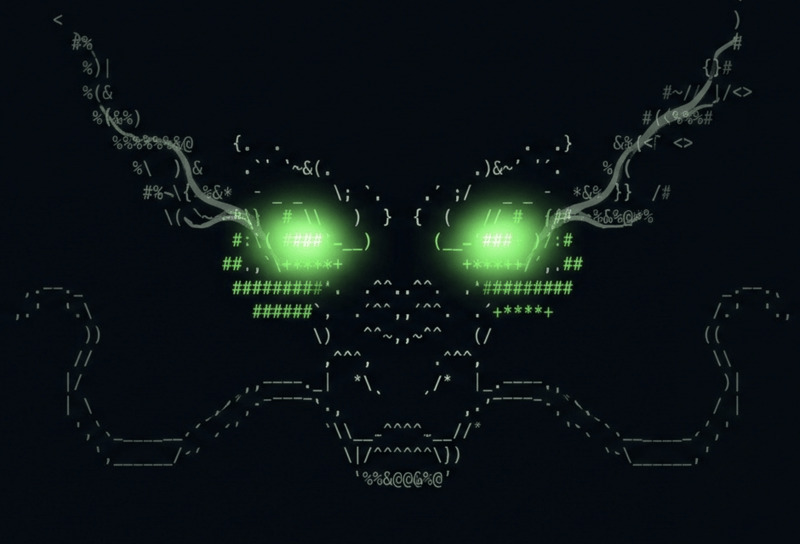

<div align="center">

<h1>Mushu</h1>
<p><b>Leave your desk, not your agents.</b></p>
</div>

> The mobile stack for AI coding agents: your phone becomes a control surface for Claude Code, Codex, OpenCode, and Cursor running in [Ghostty](https://ghostty.org) and [Herdr](https://herdr.dev) on your own machines. Same live session as your desktop, push when an agent needs you, one-tap approvals from anywhere. Fully open source, fully self-hosted.

## Features

- Real terminal on your phone, attached to the exact same Herdr session as your desktop.
- Installable PWA with a touch toolbar; sessions survive network switches and phone sleep.
- Agent inbox: live status chips for every agent (working, blocked, done, idle).
- Push notifications when an agent needs input or finishes, end-to-end encrypted.
- One-tap approve/deny, quick keys, or a full prompt, stale-guarded and audit-logged.
- Private by construction: loopback bind, published tailnet-only via Tailscale Serve. No sshd, no app store, no third-party relay.

## Install

Prerequisites: a host (macOS or Linux) running [Herdr](https://herdr.dev), a [Tailscale](https://tailscale.com) tailnet joining host and phone, Rust to build.

On each host:

```sh
git clone https://github.com/campingas/mushu && cd mushu
cargo build --release
cp target/release/mushu-server ~/.local/bin/
openssl rand -hex 24 > ~/.config/mushu-token && chmod 600 ~/.config/mushu-token

MUSHU_TOKEN=$(cat ~/.config/mushu-token) mushu-server   # serves on 127.0.0.1:8422
tailscale serve --bg http://127.0.0.1:8422              # tailnet-only HTTPS
```

Configuration is all environment variables:

| Variable | Default | Purpose |
|---|---|---|
| `MUSHU_TOKEN` | required | access token, 16+ chars |
| `MUSHU_BIND` | `127.0.0.1:8422` | listen address |
| `MUSHU_CMD` | `herdr` | command attached to the web terminal (e.g. `tmux new-session -A -s main`) |
| `MUSHU_HOST` | hostname | label shown in the inbox and notifications |

For boot persistence run it as a launchd agent (macOS) or a systemd user service with linger (Linux).

On the phone: open `https://<host>.<tailnet>.ts.net` in Safari, enter the token, Share, Add to Home Screen, open the app, tap the bell to enable notifications (iOS 16.4+).

## Use cases to render in png

- An agent hits a permission prompt while you IRL: lock screen ping, tap, approve, it keeps working.
- On the go, check what your agents did and steer them, in the same session you left at your desk.

## Status

Works best for Ghostty + Herdr users today.

- [ ] M5: polish and a reproducible setup for other Ghostty + Herdr users

See:
- [docs/plan.md](docs/plan.md) for milestones and acceptance criteria
- [docs/tasks.md](docs/tasks.md) for the checklist
- [docs/architecture.md](docs/architecture.md) for the design
- [docs/decisions.md](docs/decisions.md) for decision records

Inspired by [t3code](https://github.com/pingdotgg/t3code)'s control-surface shape, built on Herdr instead of custom agent orchestration.

## License

GPLv3. Free software stays free: use it, ship it, but keep it open.
_Others sell this experience behind paywalls and closed code; mushu does it fully open source._
