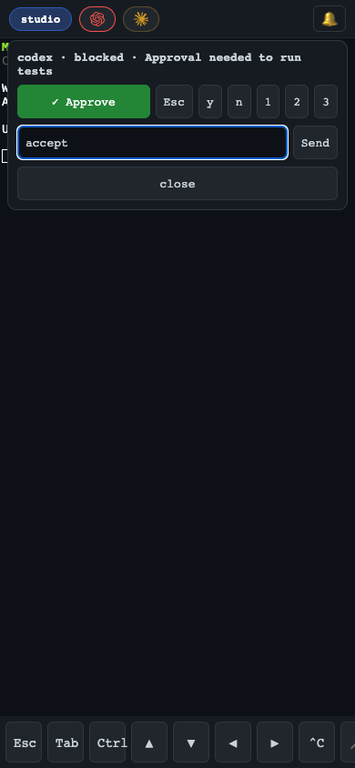
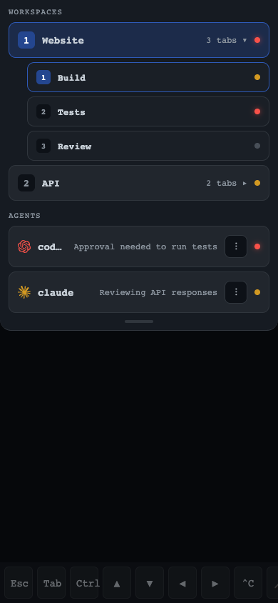

<div align="center">

<h1>Mushu</h1>
<p><b>Leave your desk, not your agents.</b></p>
</div>

> The mobile stack for AI coding agents: your phone becomes a control surface for Claude Code, Codex, OpenCode, and Cursor running in [Ghostty](https://ghostty.org) and [Herdr](https://herdr.dev) on your own machines. Same live session as your desktop, push when an agent needs you, one-tap approvals from anywhere. Fully open source, fully self-hosted.

## Features

- Real terminal on your phone, attached to the exact same Herdr session as your desktop.
- Installable PWA with a touch toolbar; sessions survive network switches and phone sleep.
- Agent inbox: live status chips for every agent (working, blocked, done, idle).
- Push notifications when an agent needs input or finishes, end-to-end encrypted.
- One-tap approve/deny, quick keys, or a full prompt, stale-guarded and audit-logged.
- All your machines in one app: switch hosts from the drawer, alerts on or off per host.
- Sign in by scanning a QR code; optionally lock your tokens behind Face ID.
- Private by construction: loopback bind, published tailnet-only via Tailscale Serve. No sshd, no app store, no third-party relay.

## Install

Prerequisites: a host (macOS or Linux) running [Herdr](https://herdr.dev), and a [Tailscale](https://tailscale.com) tailnet joining host and phone.

On each host, install `mushu-server` and `mushuctl` into `~/.local/bin`:

```sh
curl -fsSL https://raw.githubusercontent.com/campingas/mushu/main/install.sh | sh
```

Prebuilt binaries cover macOS and Linux on Intel and ARM; the Linux builds are static and need no system OpenSSL. Prefer to do it yourself? Grab the matching asset from [releases](https://github.com/campingas/mushu/releases) and verify it against the published `SHA256SUMS`, or build from source with Rust:

```sh
git clone https://github.com/campingas/mushu && cd mushu
cargo build --release
install -m 755 target/release/mushu-server scripts/mushuctl ~/.local/bin/
```

Then, on each host:

```sh
(umask 077 && openssl rand -hex 24 > ~/.config/mushu-token)

MUSHU_TOKEN_FILE="$HOME/.config/mushu-token" mushu-server # serves on 127.0.0.1:8422
tailscale serve --bg http://127.0.0.1:8422              # tailnet-only HTTPS
```

Configuration is all environment variables:

| Variable | Default | Purpose |
|---|---|---|
| `MUSHU_TOKEN_FILE` | preferred | path to an access token file, trimmed after reading; takes precedence over `MUSHU_TOKEN` |
| `MUSHU_TOKEN` | required without a token file | compatible inline access token, 16+ chars |
| `MUSHU_BIND` | `127.0.0.1:8422` | listen address |
| `MUSHU_CMD` | `herdr` | command attached to the web terminal (e.g. `tmux new-session -A -s main`) |
| `MUSHU_HOST` | hostname | label shown in the inbox and notifications |
| `MUSHU_URL` | Tailscale Serve mapping | public URL used by `mushuctl pair`, when auto-discovery cannot find it |
| `HERDR_CONFIG_PATH` | Herdr/XDG default | inherited Herdr config path used only to adapt the active host theme; ignored for a non-Herdr `MUSHU_CMD` |

For boot persistence or on-demand lifecycle control, install the repo-owned launchd or systemd user service and use [`mushuctl`](docs/mushuctl.md). It provides `start`, `stop`, `restart`, sanitized `status`, `logs`, `pair`, and `with-herdr`; keep the token file mode at `600`.

## Pair your phone

Run `mushuctl pair` on the host. It prints a QR code for the tailnet URL with the token in the URL fragment, discovering the URL from your Tailscale Serve mapping (override with `MUSHU_URL`):

```
mushuctl pair
  █▀▀▀▀▀█ ▄▄ ▀▀▄▄██▀▀██ █▀▀▀▀▀█
  █ ███ █ █▀ ███ ▀▀▀▀ ▄ █ ███ █     url:   https://your-host.tailnet.ts.net
  █ ▀▀▀ █ ██▀▄▄ ▀█ █▀▀  █ ▀▀▀ █     token: 0123456789abcdef…
  ▀▀▀▀▀▀▀ █▄▀▄▀ ▀▄▀ ▀ █▄▀▀▀▀▀▀▀
```

1. Scan it with the iPhone camera.
2. On that page: Share, then **Add to Home Screen**.
3. Open mushu from the home screen. It is already signed in.

Add to Home Screen while the fragment is still in the URL: iOS gives an installed web app a storage jar separate from Safari's, and the token travels in the bookmark. Fragments are never sent to a server, so the token never reaches a log or proxy trace.

Then open the cog and turn on alerts to enable push notifications (iOS 16.4+, requires the home screen install).

## More than one host

Run mushu-server on each host, then add the others from the cog panel: paste the second host's URL and its token (`mushuctl pair` prints both). Saved hosts appear under **hosts** in the drawer, and tapping one switches the terminal and inbox to it without leaving the app. Each host has its own alerts on/off toggle.

Push notifications from a second host need one extra step, because a browser holds a single push subscription tied to one VAPID key. Give every host the same keypair:

```sh
scp ~/.config/mushu/vapid.key otherhost:~/.config/mushu/vapid.key
ssh otherhost 'rm -f ~/.config/mushu/subscriptions.json'   # old subs used the retired key
ssh otherhost 'systemctl --user restart mushu.service'
```

Skip this and the second host's alerts will silently never arrive. Re-enable its alerts from the cog panel afterwards.

Optionally tap **enable face id lock**: your host tokens are then encrypted at rest with AES-GCM under a passkey held in the Secure Enclave, and opening the app asks for Face ID.

## Screenshots

| Permission prompt | Check and steer agents |
|---|---|
|  |  |

### Video demo

https://github.com/user-attachments/assets/29f306a6-5572-48aa-8235-7a18566b8d3f

## Status

Works best for Ghostty + Herdr users today.

- [ ] M5: polish and a reproducible setup for other Ghostty + Herdr users

See:
- [AGENTS.md](AGENTS.md) for the rules and invariants to follow when changing this repo
- [docs/development.md](docs/development.md) for building, running locally, and extending mushu
- [docs/mushuctl.md](docs/mushuctl.md) for service installation and lifecycle control
- [docs/plan.md](docs/plan.md) for milestones and acceptance criteria
- [docs/tasks.md](docs/tasks.md) for the checklist
- [docs/architecture.md](docs/architecture.md) for the design
- [docs/decisions.md](docs/decisions.md) for decision records

Inspired by [t3code](https://github.com/pingdotgg/t3code)'s control-surface shape, built on Herdr instead of custom agent orchestration.

## License

GPLv3. Free software stays free: use it, ship it, but keep it open.
_Others sell this experience behind paywalls and closed code; mushu does it fully open source._
